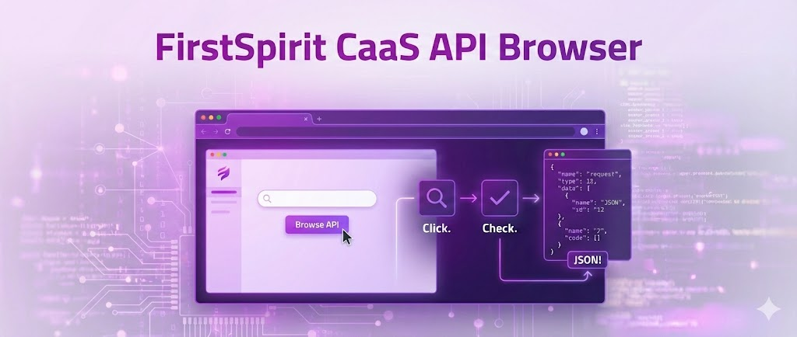

# FirstSpirit CaaS API Browser

A beginner-friendly web interface for exploring and interacting with the FirstSpirit CaaS API. This tool provides an intuitive UI approach to browse, test, and understand CaaS API endpoints without the need of deep technical knowledge.

## Getting Started

### Prerequisites

- Node.js 24 (LTS) or higher, as specified in `.nvmrc` and `package.json`
- access to a FirstSpirit CaaS API endpoint

### Installation

1. Clone the repository:

```bash
git clone git@github.com:e-Spirit-Usergroup/firstspirit-caas-api-browser.git
cd fs-caas-api-browser
```

2. Install dependencies:

```bash
npm install
```

3. Start the development server:

```bash
npm run dev
```

4. Open your browser and navigate to `http://localhost:5173`

## Configuration

The application stores the configuration in the browser's localStorage. You can configure your project through the setup wizard or by uploading a JSON configuration file.

## Authors & Maintainers

**Kevin Rieger** - [k.rieger@reply.de](mailto:k.rieger@reply.de) - [Neo Reply](https://neoreply.de)

**Felix Kratz** - [f.kratz@reply.de](mailto:f.kratz@reply.de) - [Neo Reply](https://neoreply.de)

## License

This project is licensed under the GNU General Public License v3.0 - see the [LICENSE](LICENSE) file for details.

Copyright (c) 2026 Neo Reply